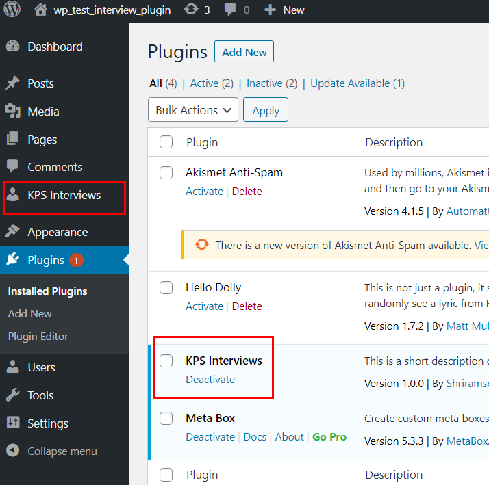
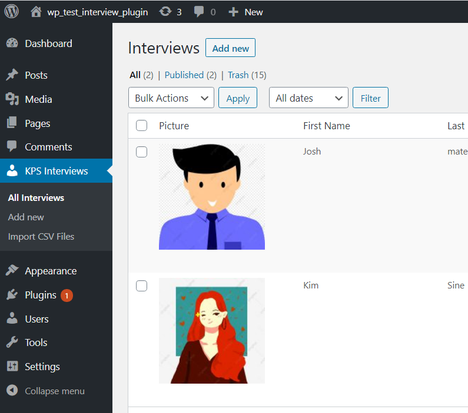
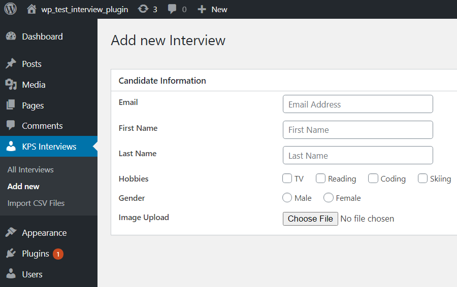
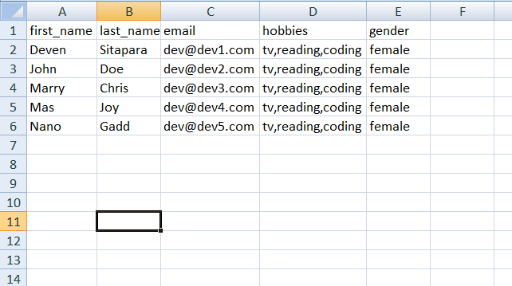
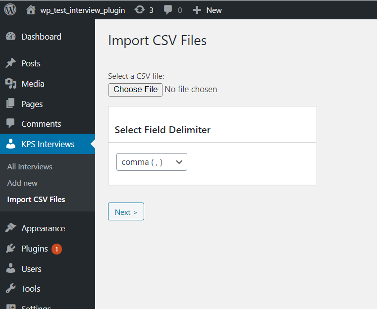
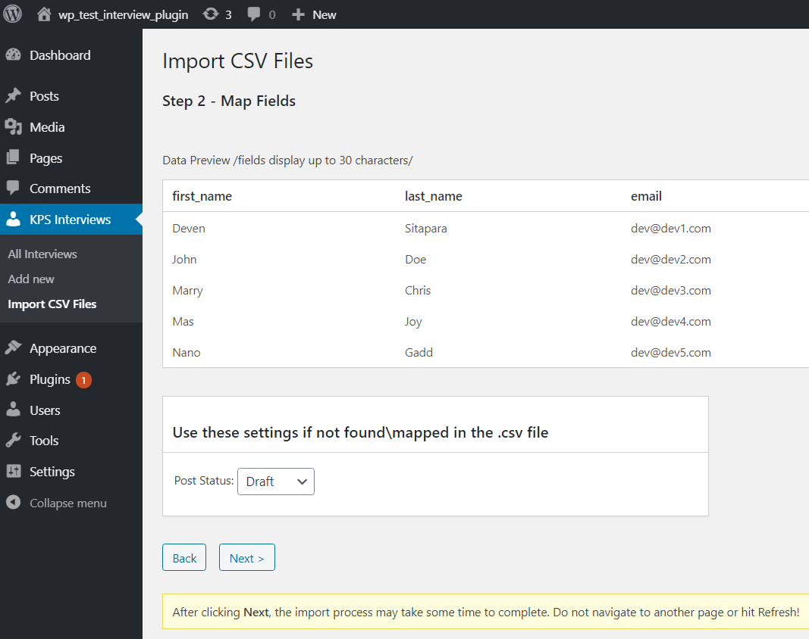
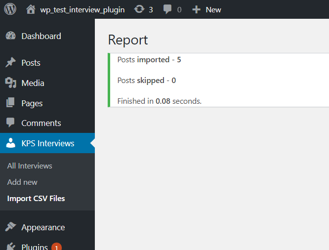

=== Plugin Name ===

Contributors: shriramsoft

Donate link: srs-kps-interviews

Tags: interviews

Requires at least: 3.0.1

Tested up to: 3.4

Stable tag: 4.3

License: GPLv2 or later

License URI: http://www.gnu.org/licenses/gpl-2.0.html

Github : https://github.com/devatsrs/kps-interviews

Add Remove Import Interview Details.

== Description ==

WordPress Task for GKB Labs Interview

Create a plugin with the following features

Admin section
a) Add an option in settings menu called demo-plugin with submenu options 1) create user 2) import users 3) list users

Create-users page:
First Name (Text Box)
Last Name (Text Box)
Email (Text Box)
Hobbies (checkbox) with option TV, Reading, coding, skiing
Gender (Radio) with options Male, Female
Upload picture (add WordPress media upload option )

Submit and Cancel buttons

Upon Submit save data into Database

3. Import users:

Provide an option to import users data from a CSV (CSV will contain above fields, first name or last name and email are mandatory )
Upon import CSV, report (display on the screen) how many were successfully imported and how many were failed

4. List Users:
   List all users with pagination
   Provider options to edit, delete

5)  Upload code into GitHub and share the link ( you may create an account if you don’t have one )

6. Find out a free hosting and upload your code as a demo (very helpful for evaluating the task )

Most importantly, plugin should follow all WordPress coding standards, and it should be export as zip and import as a plugin in other WordPress sites. The plugin should contain the SQL file required to store the user’s data and auto-execute SQL when plugin activated.

== Installation ==

1. Install plugin
2. Install Dependencies
3. Add Candidates
4. Sample csv is given in plugin folder

e.g.

1. Upload `kps-interviews` to the `/wp-content/plugins/` directory.
2. Activate the plugin through the 'Plugins' menu in WordPress.
3. Activate the dependancy plugin Meta Box.
4. Check new Menu Added Bellow Comment as shown in screenshot.

== Frequently Asked Questions ==

= A question that someone might have =

An answer to that question.

= What about foo bar? =

Answer to foo bar dilemma.

== Screenshots ==

== Changelog ==

= 1.0 =

- KPS Plugin can Add Candidate First Name, Last Name, Email, Gender , Hobbies

- Can Bulk Import.
